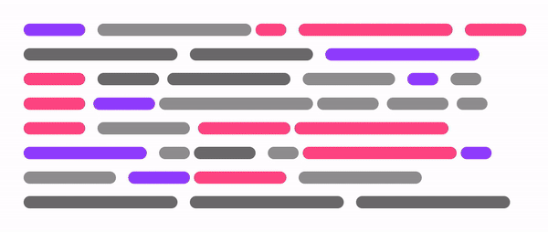
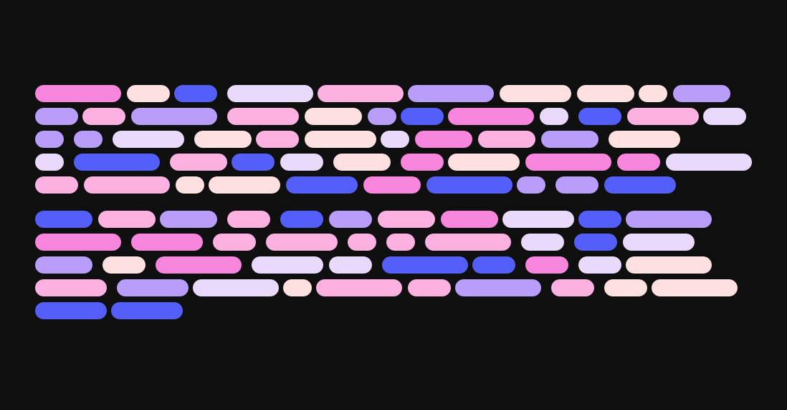

<p align="center">
  <!-- <a href="https://codesandbox.io/s/react-spectrum-animation-vp353"> -->
    <!--  -->
    
    
    
    
    
    
  <!-- </a> -->
</p>

# React Spectrum

A tiny(**around 1.2kb gzip**) React library to generate colorful text placeholders 🎨

Inspired by [this code illustration](./assets/codesandbox-illustration.png) on [CodeSandbox](https://codesandbox.io) homepage 🙏

Try out the generator at [react-spectrum.netlify.com](https://react-spectrum.netlify.com) 🎊 Also, check out [@BotSpectrum](https://twitter.com/BotSpectrum) twitter bot that tweets randomly generated colorful text placeholders for inspiration 🎊

[](https://opensource.org/licenses/mit-license.php)
[](https://github.com/ganapativs/react-spectrum/)
[](https://travis-ci.com/ganapativs/react-spectrum)
[](https://badge.fury.io/js/react-spectrum)
[](https://badge.fury.io/gh/ganapativs%2Freact-spectrum)
[](https://greenkeeper.io/)

## Demo

- [Basic](https://codesandbox.io/s/react-spectrum-demo-83c90)
- [Advanced](https://codesandbox.io/s/react-spectrum-demo-advanced-kh7zy)

## Table of Contents

- [Install](#install)
- [Usage](#usage)
- [Props](#props)
- [Contribute](#contribute)
- [License](#license)

## Install

### NPM

```sh
npm install react-spectrum
```

### Yarn

```sh
yarn add react-spectrum
```

### UMD build

```html
<script src="https://unpkg.com/react-spectrum/dist/react-spectrum.umd.js"></script>
```

## Usage

```jsx
import React from "react";
// Import library
import Spectrum from "react-spectrum";
// or const Spectrum = require('react-spectrum');

// Render the placeholder
function Placeholder() {
  return (
    <Spectrum
      width={500}
      colors={["#757575", "#999999", "#0871F2", "#BF5AF2"]}
    />
  );
}
```

## Props

| Property      | Type          | Default       | Description |
| ------------- | ------------- | ------------- | ----------- |
| `width` | `number` | `500` | Width of the placeholder container |
| `colors` | `Array<string>` | `['#eee']` | Possible colors of words, will be picked randomly |
| `wordWidths` | `Array<number>` | `[30, 60, 90, 120, 150]` | Possible widths of words, will be picked randomly |
| `wordDistances` | `Array<number>` | `[4, 8, 12]` | Possible distance between words, will be picked randomly |
| `wordHeight` | `number` | `12` | Height of every word placeholder |
| `wordRadius` | `number` | `20` | Border radius of every word |
| `lineDistance` | `number` | `12` | Distance(margin) between the lines |
| `linesPerParagraph` | `number` | `8` |  Lines per paragraph. if there are multiple paragraphs, all of them will have same number of lines |
| `paragraphs` | `number` | `1` | Number of paragraphs in the placeholder |
| `paragraphDistance` | `number` | `24` | Distance(margin) between the paragraphs |
| `truncateLastLine` | `boolean` | `true` | Show less words in the last line for more natural feel |
| `renderWord` | `function` | `({ key, style}) => <span key={key} style={style} />` | Render word with customizations(avoid overriding passed style properties. it might break the functionality) |

## Contribute

Thanks for taking the time to contribute, please check out the [src](src) to understand how things work.

### Reporting Issues

Found a problem? Want a new feature? First of all, see if your issue or idea has [already been reported](../../issues).
If don't, just open a [new clear and descriptive issue](../../issues/new).

### Submitting pull requests

Pull requests are the greatest contributions, so be sure they are focused in scope and do avoid unrelated commits.

- Fork it!
- Clone your fork: `git clone https://github.com/<your-username>/react-spectrum`
- Navigate to the newly cloned directory: `cd react-spectrum`
- Create a new branch for the new feature: `git checkout -b my-new-feature`
- Install the tools necessary for development: `yarn`
- Make your changes.
- Commit your changes: `git commit -am 'Add some feature'`
- Push to the branch: `git push origin my-new-feature`
- Submit a pull request with full remarks documenting your changes

## License

[MIT License](https://opensource.org/licenses/MIT) © [Ganapati V S](https://meetguns.com)
